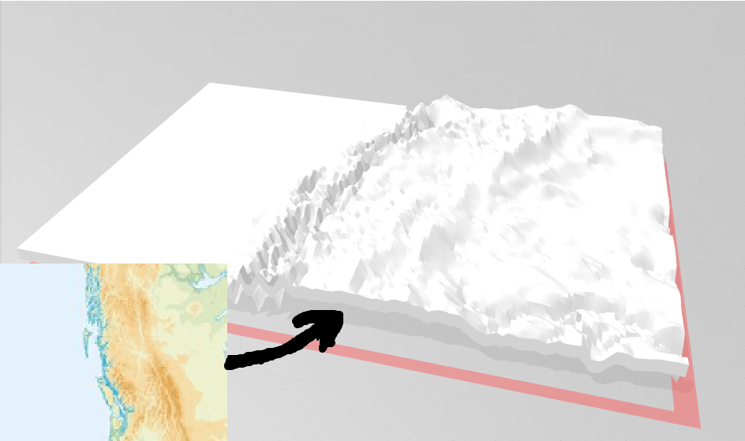
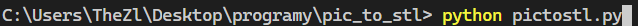
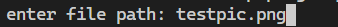
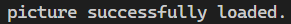
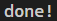

### PicToMap is python code for generating STL file with picture input.
## Before & after:

## How to use:
1) Download the [python file](pictostl.py)
2) If you dont have Pillow (PIL) module installed - add it [tutorial here](https://pillow.readthedocs.io/en/stable/installation.html)
3) Run the code with following command:
### pyhton <pictostl.py file path>
4) The program should ask you for your image file path
5) Once you enter the correct path, wait until the terminal says it's done
6) Your STL file should appear in the same directory as your python file

#### Example:
run the code:

enter the path of your png file:

and wait for the message:

once it says it's done you can look for the STL file in your python file directory:

